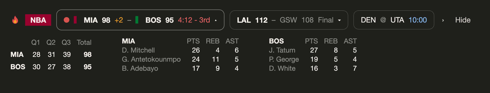
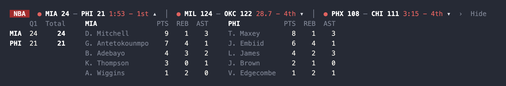

# pusung-mods

English · [繁體中文說明](mods/nba-scores-mod/README.zh-TW.md)

[](LICENSE) 

Mods for [Claude Code](https://claude.com/claude-code) by Pu-Sung Chang. They draw in the band above the prompt and never spend model tokens.

## nba-scores-mod

Live NBA scores above the prompt, in the terminal and the desktop app.





- Live scores every 30 seconds, live games first
- Pick your team; in the desktop app it gets its own totem and team color
- Open any game for the score by quarter and top scorers
- Optional spoiler-free mode
- English and Traditional Chinese
- No API key, no account, zero model tokens


**[Full documentation →](mods/nba-scores-mod/README.md)**

## Install

1. Add this marketplace:

   ```sh
   claude plugin marketplace add miami1124/pusung-mods
   ```

2. Install the mod:

   ```sh
   claude plugin install nba-scores-mod@pusung-mods
   ```

3. Quit Claude Code completely and open it again.

Requires Claude Code 2.1.287 or later. Tested on macOS (Terminal.app and the desktop app); Windows and Linux are untested.

## Repo layout

```
.claude-plugin/marketplace.json   makes this repo installable as a marketplace
docs/                             images used in the READMEs
mods/<name>/                      one folder per mod; each is a plugin
  .claude-plugin/plugin.json      the mod's manifest and settings
  hooks/                          the code
  tests/                          tests, run with `claude plugin test`
  README.md                       the mod's own docs
```

## Develop

```sh
# try a mod without installing it; it reloads when you save
claude --plugin-dir mods/nba-scores-mod

# run the tests
claude plugin test mods/nba-scores-mod

# lint. no-shadow matters: a local variable named `next` inside a hook shadows
# the hook's continuation and the module fails to load, and tsc does not catch it
npx oxlint@1.83.0 mods/nba-scores-mod/hooks
```

Issues and pull requests are welcome.

## Author

Pu-Sung Chang · [GitHub](https://github.com/miami1124) · Instagram [@pusung.ai](https://www.instagram.com/pusung.ai) · Threads [@pusung.305](https://www.threads.net/@pusung.305)

## License

[MIT](LICENSE). Use it and modify it freely. Just keep the copyright notice.
