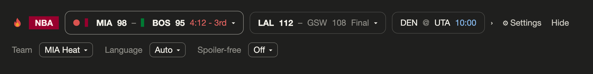
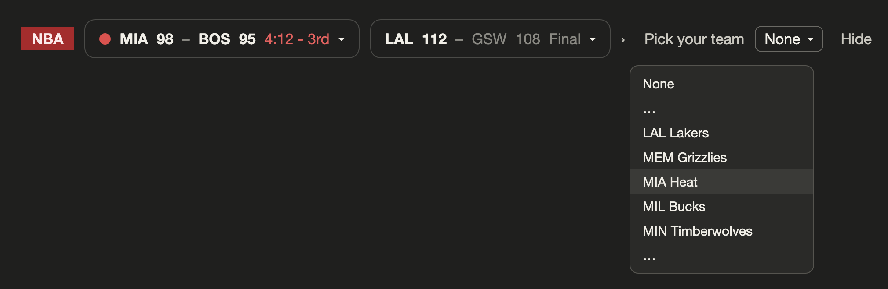

# nba-scores-mod

English · [繁體中文](README.zh-TW.md)

[](../../LICENSE)  

Live NBA scores in a thin band above the Claude Code prompt. Works in the terminal and in the desktop app's Code tab.

**Desktop app**


**Terminal**


*The images on this page are illustrations with made-up scores.*

## Features

- **Live scores**, refreshed every 30 seconds while a game is on. Live games come first.
- **Pick your team** and its games move to the front. In the desktop app your team also gets its own totem and team-colored badge.
- **Score changes are easy to catch**: the old score shows with `+2` for a few seconds, then switches to the new one.
- **Open any game** (`▾`) for the score by quarter and each team's top scorers.
- **Spoiler-free mode** (off by default) hides final scores until you ask for them.
- **English and Traditional Chinese.**
- **Zero model tokens.** It never calls a model and never reads your prompts or code. It fetches a public scoreboard and draws it.
- No API key, no account.

## Install

```sh
claude plugin marketplace add miami1124/pusung-mods
```

```sh
claude plugin install nba-scores-mod@pusung-mods
```

Then **quit Claude Code completely and open it again**. In the desktop app that means Cmd+Q, not just closing the window.

To remove it, uninstall the mod and then drop the marketplace:

```sh
claude plugin uninstall nba-scores-mod@pusung-mods
```

```sh
claude plugin marketplace remove pusung-mods
```

Restart Claude Code and the band is gone. The mod leaves no files of its own behind.

## Requirements

- **Claude Code 2.1.287 or later.** Mods are on by default from that version. On older versions, add `"CLAUDE_CODE_ENABLE_FUNCTION_HOOKS": "1"` to the `env` block of `~/.claude/settings.json` and restart.
- An interactive terminal session, or the desktop app's Code tab. The band is not drawn in `claude -p`, in the VS Code extension, or on mobile.
- Tested on macOS with Claude Code 2.1.293 (Terminal.app and the desktop app). Windows and Linux are untested; reports are welcome.

## Settings

There are three settings. The desktop app and the terminal keep their own copies, so set them once in each place you use.

| Setting | Default | What it does |
| :-- | :-- | :-- |
| **Team** | `None` | Your team's games are listed first. In the desktop app the badge takes your team's colors and a small totem appears next to it. |
| **Language** | `Auto` | `Auto` shows Traditional Chinese when your computer is on Taiwan time and English everywhere else. Pick `English` or `繁體中文` to force one. |
| **Spoiler-free** | `Off` | `On` hides the score of finished games. Click **Reveal** on a game, or **Reveal all**. Live games are never hidden. Revealed games are hidden again the next time you open Claude Code. |

**In the desktop app**, click **⚙ Settings** on the band. A row with the three settings opens; click it again to close the row.



Until you choose a team, a **Pick your team** dropdown also sits on the band itself.



**In the terminal**, run `/config` and scroll to the nba-scores-mod rows (`Your team`, `Language`, `Spoiler-free`).

## Team totems

Each of the 30 teams has a small two-color icon, shown next to the badge in the desktop app once you pick that team.


They are small icons I made myself for each team: a flame for Miami, a clover for Boston, a rocket for Houston.

## Desktop app and terminal

Both show the same games in the same order, with the same controls.

| | Desktop app | Terminal |
| :-- | :-- | :-- |
| Layout | A row of cards | One line of text |
| Team totem and team-colored badge | Yes | No (the badge is always red) |
| Games that do not fit | `‹` `›` to page | `‹` `›` to page |
| Score by quarter and top scorers | Yes | Yes |
| Spoiler-free mode | Yes | Yes |

The terminal can only draw characters, so the totems are desktop only.

## Which games you see

ESPN's "today" follows US dates, which is awkward in other time zones. This mod works out the NBA game day itself: the day rolls over at 11 AM US Eastern, when last night's games are over and tonight's have not started. So in Asia you see the games played this morning for the rest of your day, not tomorrow's schedule.

Tip-off times are shown in your computer's time zone. On a day with no games, the band shows the next games on the schedule.

## Troubleshooting

**Nothing shows up.** There is no error message when the band is missing. Check these in order:

1. **Claude Code is older than 2.1.287.** Run `claude --version`. Update, or turn on the flag described under Requirements.
2. **You have not fully restarted.** Quit Claude Code completely and open it again.
3. **It is not installed.** Run `claude plugin list` and look for `nba-scores-mod@pusung-mods` with status enabled.
4. **You are somewhere the band is not drawn**: `claude -p`, the VS Code extension, or mobile.

**"Scores not updating".** A `⚠ Scores not updating (last fetched N min ago)` warning means the last fetch failed and you are looking at old numbers. The mod says so on purpose instead of passing stale scores off as live. It retries on its own, at most a minute apart while a game is live. If it never recovers, ESPN has probably changed something: the endpoints this mod reads are public but undocumented, and they can change without notice. Please open an issue.

## Advanced: config file

Not needed for normal use. `~/.claude/nba-scores-mod.json` accepts a few extra fields:

| Field | Default | What it does |
| :-- | :-- | :-- |
| `log` | `false` | Writes one line per fetch to `~/.claude/nba-scores-mod.<start time>.log`. For debugging; every session creates a new file. |
| `date` | `""` | Pins the band to one day (`YYYYMMDD`). For development during the off-season. |
| `team`, `spoilerFree` | | Same as the settings above. The settings win if both are set. |

## Privacy and network

- It connects to one host: `site.api.espn.com`.
- It reads one file, `~/.claude/nba-scores-mod.json`, if it exists.
- It writes nothing to disk unless you turn on `log`. Your settings and whether the band is collapsed are stored in Claude Code's own settings.
- It does not call any model, read your code, or see your conversation. It registers two hooks, `session.start` and `ui.render`.

## Good to know

Mods are a new Claude Code feature and the API underneath is still changing, so an update to Claude Code can break this one. Bug reports and ideas are welcome in [Issues](https://github.com/miami1124/pusung-mods/issues).

## Disclaimer

This is an unofficial fan project. It is not affiliated with, endorsed by, or sponsored by the NBA, any NBA team, or ESPN. Team names and abbreviations belong to their owners and are used only to identify the teams. Scores come from ESPN's public endpoints and are provided as is, for personal, non-commercial use.

The MIT license covers this project's code only. The team totems are fan art, and each team's name and identity belong to that team. Please do not use the totems commercially.

## License

[MIT](../../LICENSE). Use it and modify it freely. Just keep the copyright notice.
