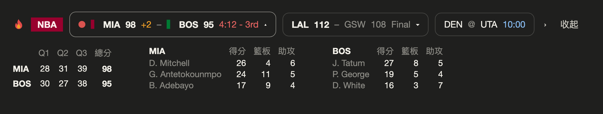
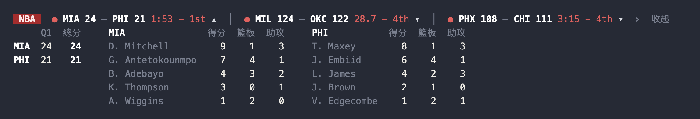
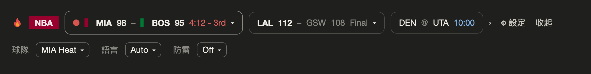
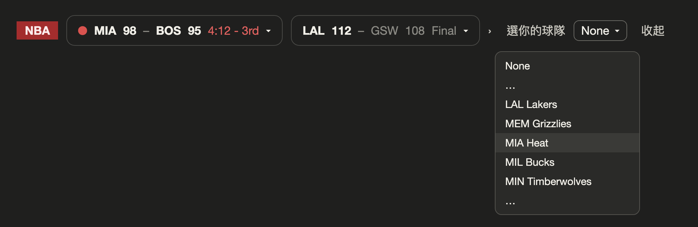
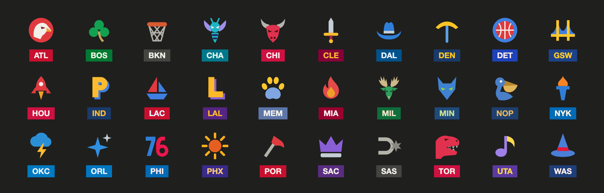

# nba-scores-mod

[English](README.md) · 繁體中文

[](../../LICENSE)  

在 Claude Code 輸入框上方放一條 NBA 即時比分。終端機和桌面版 app 的 Code 分頁都能用。

**桌面版**



**終端機**



*這一頁的圖都是示意圖，比分是編的。*

## 功能

- **即時比分**，有比賽在打時每 30 秒更新一次，正在打的排最前面。
- **選你的球隊**，那一隊的比賽會排到前面。桌面版還會有那一隊專屬的小圖騰和隊色徽章。
- **得分一眼看得到**：先顯示舊比分加 `+2` 幾秒，再換成新比分。
- **點開任何一場**（`▾`）看每節比分和兩隊得分前幾名。
- **防雷模式**（預設關閉）：打完的比賽先把比分遮住，你點了才顯示。
- **英文和繁體中文**。
- **不花任何 model token。** 它不呼叫模型，也不讀你的對話和程式碼，只是抓公開的比分資料畫出來。
- 不用 API key，不用註冊帳號。

## 安裝

```sh
claude plugin marketplace add miami1124/pusung-mods
```

```sh
claude plugin install nba-scores-mod@pusung-mods
```

接著**把 Claude Code 完全關掉再重開**。桌面版要按 Cmd+Q，只關視窗不算。

移除：

```sh
claude plugin uninstall nba-scores-mod@pusung-mods
```

## 需求

- **Claude Code 2.1.287 以上。** 這個版本開始 mods 預設開啟。更舊的版本要在 `~/.claude/settings.json` 的 `env` 區塊加上 `"CLAUDE_CODE_ENABLE_FUNCTION_HOOKS": "1"` 再重開。
- 互動式的終端機，或桌面版 app 的 Code 分頁。`claude -p`、VS Code 擴充套件、手機版不會出現這條帶子。
- 在 macOS、Claude Code 2.1.293 測過（Terminal.app 和桌面版 app）。Windows 和 Linux 沒測過，歡迎回報。

## 設定

一共三個設定。桌面版和終端機各存各的，所以你用哪一邊，就要在那一邊設一次。

| 設定 | 預設 | 作用 |
| :-- | :-- | :-- |
| **球隊** | `None` | 你的球隊的比賽排最前面。桌面版的徽章會換成隊色，旁邊多一個小圖騰。 |
| **語言** | `Auto` | `Auto` 會在電腦時區是台灣時顯示繁體中文，其他地方顯示英文。想固定就選 `English` 或 `繁體中文`。 |
| **防雷** | `Off` | 選 `On` 會遮住已結束比賽的比分。點那一場的「看結果」或「揭曉全部」才顯示。正在打的比賽不會遮。下次打開 Claude Code 會重新遮住。 |

**桌面版**：點帶子上的「⚙ 設定」，會多出一排三個設定；再點一次收回去。



還沒選球隊之前，帶子上也會有一個「選你的球隊」下拉選單。



**終端機**：輸入 `/config`，往下找到 nba-scores-mod 那幾列（`Your team`、`Language`、`Spoiler-free`）。

## 球隊圖騰

30 隊各有一個雙色小圖示。在桌面版選了哪一隊，那一隊的圖騰就會出現在徽章旁邊。



這些是根據各隊的 logo 或隊名的意思畫出來的原創小圖：邁阿密是火焰、波士頓是三葉草、休士頓是火箭。

## 桌面版和終端機的差別

兩邊顯示的比賽、順序和操作都一樣。

| | 桌面版 | 終端機 |
| :-- | :-- | :-- |
| 排版 | 一排小卡 | 一行文字 |
| 球隊圖騰和隊色徽章 | 有 | 沒有（徽章固定紅色） |
| 放不下的場次 | 按 `‹` `›` 翻 | 按 `‹` `›` 翻 |
| 每節比分和得分前幾名 | 有 | 有 |
| 防雷模式 | 有 | 有 |

終端機只能畫文字，所以圖騰只有桌面版有。

## 你看到的是哪一天的比賽

ESPN 的「今天」是照美國日期算的，在其他時區很不好用。這個 mod 自己算 NBA 比賽日：換日線放在美東時間早上 11 點，那時前一晚的比賽都打完、當晚的還沒開始。所以在台灣，你一整天看到的都是今天早上打的那批比賽，不會變成明天的賽程。

開賽時間會換算成你電腦的時區。當天沒有比賽時，帶子會顯示賽程上的下一批比賽。

## 疑難排解

**裝了沒出現。** 帶子沒出現時不會有任何錯誤訊息。請依序檢查：

1. **Claude Code 版本低於 2.1.287。** 執行 `claude --version` 看看。更新，或照「需求」那段打開開關。
2. **沒有完全重開。** 把 Claude Code 整個關掉再打開。
3. **沒有裝成功。** 執行 `claude plugin list`，要看得到 `nba-scores-mod@pusung-mods` 而且狀態是 enabled。
4. **你用的地方本來就不會畫**：`claude -p`、VS Code 擴充套件、手機版。

**出現「資料未更新」。** 看到 `⚠ 資料未更新（N 分鐘前抓的）` 代表最近一次沒抓到資料，畫面上是舊的比分。這是刻意講出來的，不想把過期的比分當成即時的。它會自己重試，有比賽在打時最久隔一分鐘。如果一直沒恢復，多半是 ESPN 那邊改了東西：這個 mod 讀的是公開但沒有官方文件的端點，可能無預警變動。請開 issue 告訴我。

## 進階：設定檔

一般使用不需要。`~/.claude/nba-scores-mod.json` 可以放幾個額外欄位：

| 欄位 | 預設 | 作用 |
| :-- | :-- | :-- |
| `log` | `false` | 每抓一次比分就寫一行到 `~/.claude/nba-scores-mod.<開啟時間>.log`。排查問題用，每開一次 Claude Code 就多一個檔案。 |
| `date` | `""` | 固定看某一天（`YYYYMMDD`）。休賽期開發用。 |
| `team`、`spoilerFree` | | 跟上面的設定一樣。兩邊都有設的話，以上面的設定為準。 |

## 隱私與網路

- 只連一個網站：`site.api.espn.com`。
- 只讀一個檔案：`~/.claude/nba-scores-mod.json`（有的話）。
- 除非你打開 `log`，否則不寫任何檔案。你的設定和帶子有沒有收起來，是存在 Claude Code 自己的設定裡。
- 不呼叫任何模型，不讀你的程式碼，也看不到你的對話。只註冊兩個 hook：`session.start` 和 `ui.render`。

## 先說在前面

mods 是 Claude Code 的新功能，底層還在變動，Claude Code 更新後這個 mod 有可能壞掉。發現問題或有想法，歡迎到 [Issues](https://github.com/miami1124/pusung-mods/issues) 告訴我。

## 聲明

這是非官方的球迷專案，與 NBA、任何 NBA 球隊、ESPN 都沒有關係，也沒有獲得它們的認可或贊助。球隊名稱與代號屬於各自的權利人，這裡只用來指稱球隊。比分來自 ESPN 的公開端點，照原樣提供，僅供個人、非商業使用。

## 授權

[MIT](../../LICENSE)。可以自由使用、修改，只要保留版權聲明。
